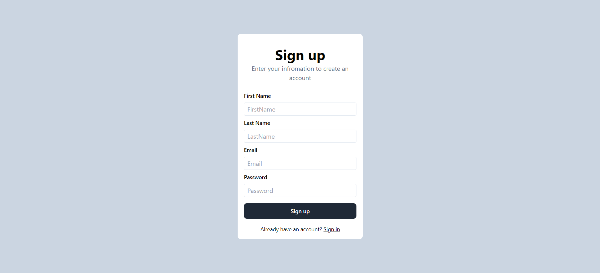
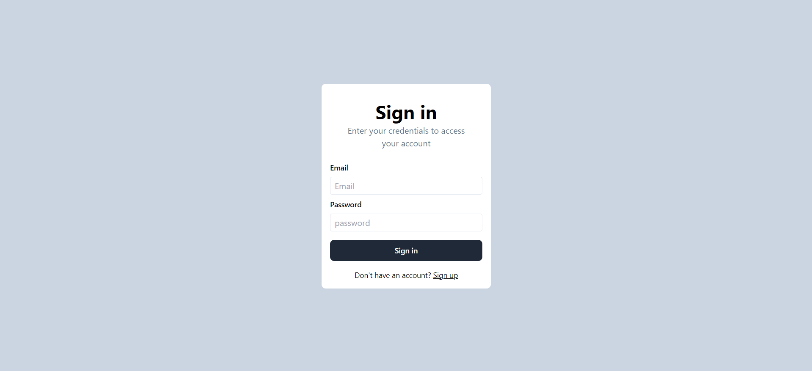
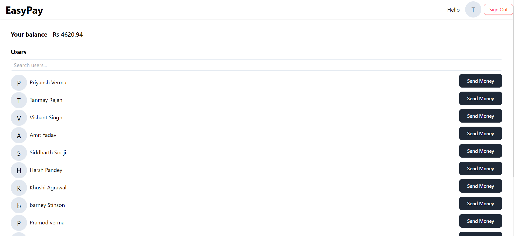
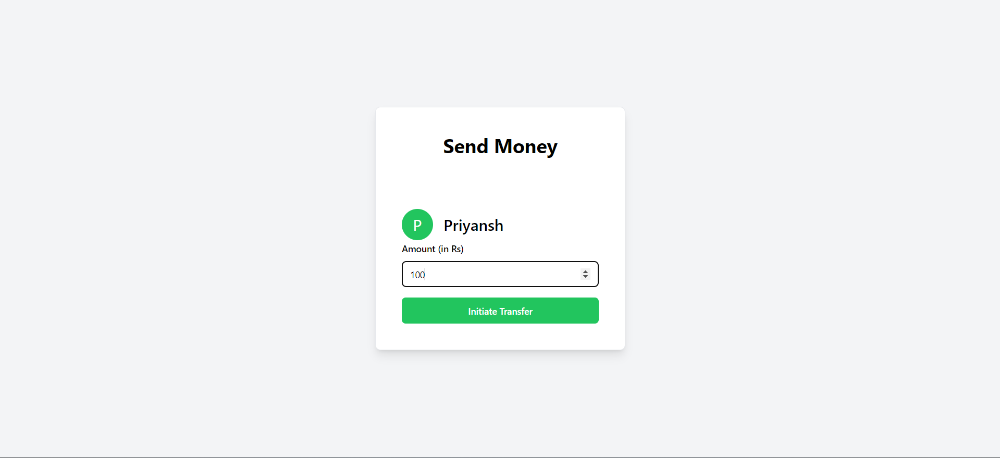

# EasyPay

EasyPay is a simple web application that allows users to sign up, sign in, and perform money transfers among registered users.

# Snapshots
- **Signup** 
- **SignIn** 
- **Dashboard** 
- **Send Money** 

## Features

- **User Authentication**: Users can sign up for an account or sign in with their credentials.
- **Random Balance Generation**: Upon signing up, users are assigned a random balance ranging from 1 to 10,000.
- **Dashboard**: After authentication, users are redirected to the dashboard, where they can view other registered users and perform money transfers.
- **Money Transfer**: Users can choose any amount of money from their balance and send it to other registered users.
- **Real-time Balance Update**: Upon completing a money transfer, the user's balance is updated in real-time on the dashboard.
- **Sign Out**: Users can sign out of their account to securely log out of the application.

## Technologies Used

- **Frontend**: HTML, CSS, JavaScript, React.js, TailwindCSS
- **Backend**: Node.js, Express.js
- **Database**: MongoDB
- **Authentication**: JSON Web Tokens (JWT)
- **Deployment**: Vercel

## Getting Started

To run this project locally, follow these steps:

### Step 1: Clone the Repository

Clone this repository to your local machine using the following command:

```bash
git clone https://github.com/prynsh/EasyPay.git
```

## Step 2: Navigate to the Project Directory


```bash
cd EasyPay
```

## Step 3: Install Dependencies


```bash
npm install
```

## Step 4: Set Up Environment Variables

   - `PORT`: Port number for the server.
   - `MONGODB_URI`: MongoDB connection URL and connect the MongoDB
   - `JWT_SECRET`: Secret key for JWT token generation.

## Step 5: Start the Server

```bash
npm run dev
```
